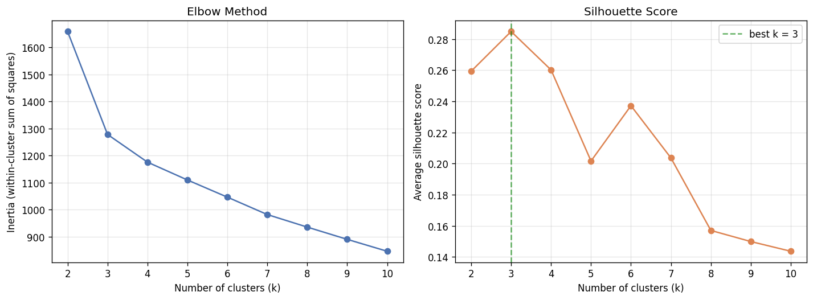
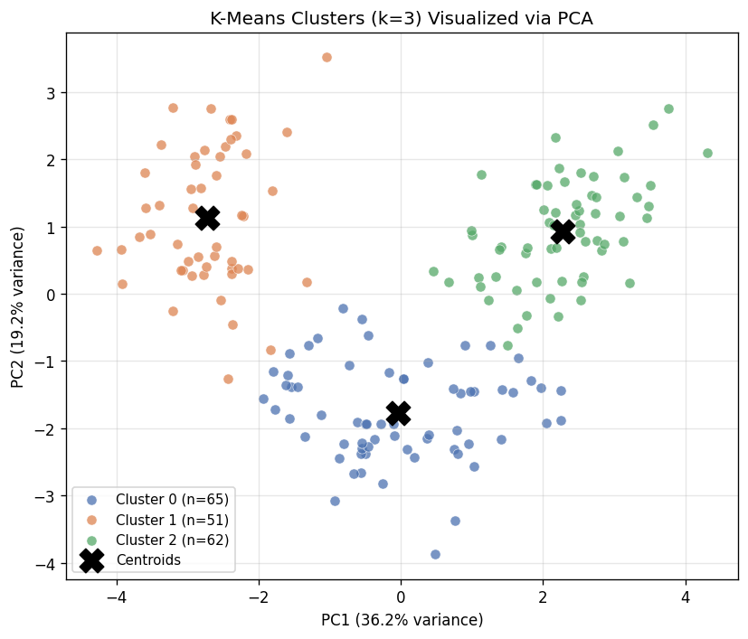

# Unsupervised Learning Pipeline: K-Means + PCA on Wine Chemistry Data

## 1. Dataset

I used the **UCI Wine dataset** (built into scikit-learn) — 178 wine samples, each described by
**13 numeric chemical/physical measurements** taken during a chemical analysis of wines grown in the
same region of Italy but derived from **three different cultivars** (grape varieties).

The cultivar label exists in the raw data but was **dropped before any modeling** and used only at
the very end, purely as a sanity check on what the unsupervised pipeline discovered on its own.

Features used for clustering: `alcohol`, `malic_acid`, `ash`, `alcalinity_of_ash`, `magnesium`,
`total_phenols`, `flavanoids`, `nonflavanoid_phenols`, `proanthocyanins`, `color_intensity`, `hue`,
`od280/od315_of_diluted_wines`, `proline`.

## 2. Preprocessing

All 13 features were **standardized** (zero mean, unit variance) with `StandardScaler` before
clustering. This step matters a lot here: `proline` is measured in the hundreds while `hue` is
close to 1 — without scaling, K-Means (which is purely distance-based) would be dominated by
whichever feature has the largest raw numeric range.

## 3. Choosing k: elbow method + silhouette score

K-Means was run for **k = 2 through 10**, tracking inertia (within-cluster sum of squares) and the
average silhouette score at each k.

- **Elbow method:** inertia drops sharply from k=2 to k=3, then the rate of improvement flattens out
  noticeably — the classic "elbow" sits at **k=3**.
- **Silhouette score:** peaks at **k=3** (0.285) and declines for every k after that.

Both methods agree, so I chose **k = 3**.

## 4. K-Means clustering

Final model: `KMeans(n_clusters=3, n_init=10, random_state=42)` fit on the standardized data.

Resulting cluster sizes: Cluster 0 = 65 wines, Cluster 1 = 51 wines, Cluster 2 = 62 wines.

## 5. PCA for visualization

PCA was fit on the same standardized data and reduced to 2 components:

| Component | Explained variance ratio |
|---|---|
| PC1 | 36.2% |
| PC2 | 19.2% |
| **Total (2D projection)** | **55.4%** |

So the 2D scatter plot below captures **55.4% of the total variance** in the original 13-dimensional
feature space — a solid (not perfect) summary. For reference, adding a 3rd component brings the
cumulative total to **66.5%** of variance explained.

The three clusters separate cleanly in PCA space, with only minor overlap between Cluster 0 and
Cluster 2 near the boundary — consistent with the moderate (not perfect) 55% variance capture.

## 6. Validation against real cultivar labels (post-hoc only)

Since this dataset happens to have real ground-truth cultivar labels, I checked them **after**
clustering was complete, purely to sanity-check the result — not used anywhere in the pipeline itself.

| Cluster | class_0 | class_1 | class_2 |
|---|---|---|---|
| Cluster 0 | 0 | 65 | 0 |
| Cluster 1 | 0 | 3 | 48 |
| Cluster 2 | 59 | 3 | 0 |

**Adjusted Rand Index = 0.897** — the unsupervised clusters recovered the true cultivar structure
almost perfectly, with only 6 of 178 wines (3.4%) assigned differently than their true cultivar.
Cluster 0 ≈ true cultivar 1, Cluster 1 ≈ true cultivar 2, Cluster 2 ≈ true cultivar 0.

## 7. Cluster profiles (mean feature values, original units)

| Feature | Cluster 0 | Cluster 1 | Cluster 2 |
|---|---|---|---|
| alcohol | 12.25 | 13.13 | **13.68** |
| malic_acid | 1.90 | **3.31** | 2.00 |
| ash | 2.23 | 2.42 | 2.47 |
| alcalinity_of_ash | 20.06 | **21.24** | 17.46 |
| magnesium | 92.74 | 98.67 | **107.97** |
| total_phenols | 2.25 | 1.68 | **2.85** |
| flavanoids | 2.05 | 0.82 | **3.00** |
| nonflavanoid_phenols | 0.36 | **0.45** | 0.29 |
| proanthocyanins | 1.62 | 1.15 | **1.92** |
| color_intensity | 2.97 | **7.23** | 5.45 |
| hue | 1.06 | 0.69 | 1.07 |
| od280/od315_of_diluted_wines | 2.80 | 1.70 | **3.16** |
| proline | 510 | 619 | **1100** |

## 8. Written interpretation — what do these clusters mean?

In real-world terms, the three clusters correspond almost one-to-one with **three distinct grape
cultivars**, and the chemistry that separates them tells a coherent story:

- **Cluster 0 — "Light, low-phenolic wines."** Lowest alcohol (12.25%), lowest color intensity
  (2.97), and the lowest proline (510) of the three groups. Moderate phenolic content. These read
  as lighter-bodied wines with less pigment extraction and lower amino-acid reserves — consistent
  with a distinct, less intensely-processed cultivar.

- **Cluster 1 — "Deeply colored, high-acid, low-flavanoid wines."** By far the **highest color
  intensity** (7.23, over double Cluster 0's) and **highest malic acid** (3.31), but the **lowest
  flavanoids** (0.82) and lowest hue. This is a chemically distinctive profile: heavy pigment
  extraction paired with sharper acidity and comparatively little of the flavanoid antioxidant
  compounds that usually track with color in wine — suggesting a different fermentation/extraction
  style or cultivar chemistry rather than "more of everything."

- **Cluster 2 — "Rich, high-alcohol, phenolically dense wines."** Highest alcohol (13.68%), highest
  magnesium, highest total phenols, highest flavanoids (3.00), and dramatically higher proline
  (1100 vs. ~510–620 for the others). Proline is a strong proxy for vine nitrogen nutrition and
  ripeness; combined with high phenolics and alcohol, this cluster reads as the most "full-bodied,
  structurally robust" group of wines.

**Bottom line:** K-Means, using only chemistry measurements and no label information, rediscovered
essentially the same partition that oenologists would get from knowing the grape cultivar directly
(ARI = 0.897). This is a good demonstration of unsupervised learning's core promise: the clusters
aren't arbitrary — they reflect a real, physically meaningful grouping (cultivar-driven chemical
profile) that was recoverable purely from the feature geometry, without ever telling the algorithm
what a "cultivar" is.

A secondary takeaway: the 6 mismatched wines (Cluster 1 vs Cluster 2 boundary, 3 samples in each
direction) are exactly the kind of borderline cases you'd expect — wines whose chemistry sits between
two cultivar profiles, visible in the PCA plot as the small area of overlap between the orange and
green point clouds.
